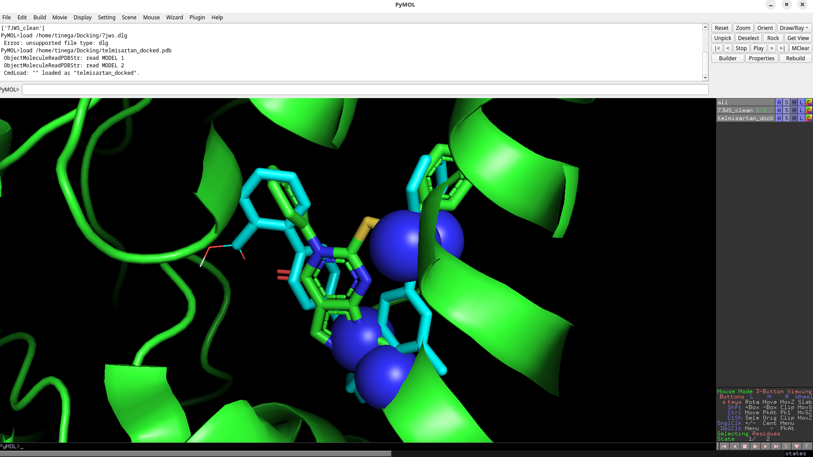
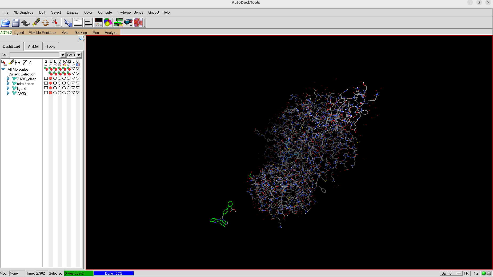
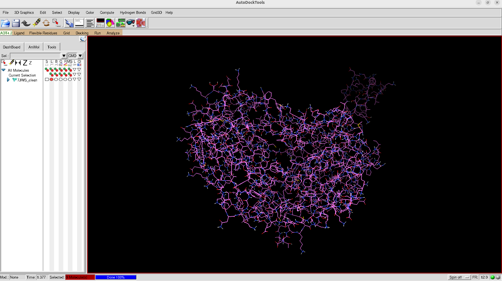
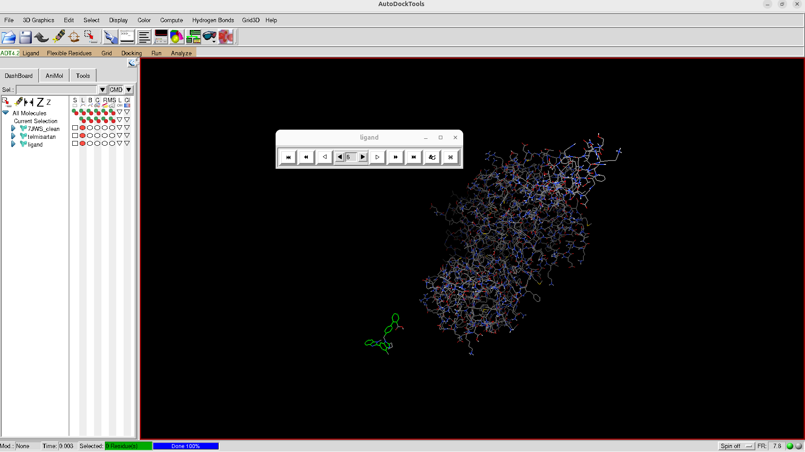

# 🔬 Molecular Docking Study: Telmisartan vs ALDH1A1 (7JWS)

> **Drug Repurposing Study** | AutoDock 4.2 | Kenyatta University | Tinega Chris | June 2026



---

## 📋 Project Overview

This study investigates the potential of **Telmisartan** (an antihypertensive drug) as an inhibitor of
**ALDH1A1** (Aldehyde Dehydrogenase 1A1), a cancer stem cell marker overexpressed in multiple cancers.
Using computational molecular docking, we predict the binding affinity and binding pose of Telmisartan
within the active site of the 7JWS crystal structure.

---

## 🧬 Molecules Involved

| Molecule | Description | Source |
|---|---|---|
| **7JWS** | ALDH1A1 protein (human) — cancer stem cell enzyme | RCSB Protein Data Bank |
| **Telmisartan** | Angiotensin II receptor blocker (antihypertensive drug) | PubChem CID: 3034034 |

---

## 📁 Project File Structure

```
~/Docking/
│
├── 📂 ORIGINAL FILES
│   ├── 7JWS.pdb                  # Original protein from PDB (with water, HETATM, duplicates)
│   └── telmisartan.sdf           # Original ligand from PubChem (SDF format)
│
├── 📂 CLEANED / PREPARED FILES
│   ├── 7JWS_clean.pdb            # Cleaned protein (water removed, single chain)
│   ├── 7JWS_clean.pdbqt          # Receptor ready for AutoDock (charges + atom types added)
│   └── ligand.pdbqt              # Telmisartan prepared for docking (8 rotatable bonds)
│       telmisartan.pdb           # Ligand in PDB format (converted from SDF via OpenBabel)
│
├── 📂 GRID / AUTOGRID FILES
│   ├── 7jws.gpf                  # AutoGrid parameter file (grid box settings)
│   ├── 7jws.glg                  # AutoGrid log file
│   ├── 7JWS_clean.maps.fld       # Grid field file (index of all maps)
│   ├── 7JWS_clean.maps.xyz       # Grid dimensions and coordinates
│   ├── 7JWS_clean.A.map          # Aromatic carbon affinity map
│   ├── 7JWS_clean.C.map          # Carbon affinity map
│   ├── 7JWS_clean.N.map          # Nitrogen affinity map
│   ├── 7JWS_clean.NA.map         # Nitrogen H-bond acceptor map
│   ├── 7JWS_clean.OA.map         # Oxygen H-bond acceptor map
│   ├── 7JWS_clean.HD.map         # Hydrogen donor map
│   ├── 7JWS_clean.e.map          # Electrostatics map
│   └── 7JWS_clean.d.map          # Desolvation map
│
├── 📂 DOCKING FILES
│   ├── 7jws.dpf                  # AutoDock parameter file (GA settings)
│   ├── 7jws.dlg                  # ⭐ Main docking results file (all 10 runs)
│   ├── AD4.1_bound.dat           # AutoDock 4 force field parameters
│   └── AD4_parameters.dat        # Additional parameter file
│
├── 📂 RESULTS
│   ├── best_pose_run6.pdb        # ⭐ Best docking pose (Run 6, -11.62 kcal/mol)
│   ├── telmisartan_docked.pdb    # Extracted docked coordinates for PyMOL
│   ├── 6.png                     # 🖼️ Best pose Run 6 — AutoDockTools screenshot
│   ├── 6_vis.png                 # 🖼️ Best pose Run 6 — PyMOL 3D ribbon visualisation
│   ├── protein_lig.png           # 🖼️ Original 7JWS protein with co-crystallised ligand
│   ├── clean.png                 # 🖼️ Cleaned 7JWS_clean protein (water/HETATM removed)
│   └── play.png                  # 🖼️ Additional visualisation
│
└── 📂 EXECUTABLES
    ├── autodock4                 # AutoDock4 binary
    └── autogrid4                 # AutoGrid4 binary
```

---

## 🔄 Workflow Pipeline

```
Step 1          Step 2           Step 3          Step 4          Step 5
┌─────────┐    ┌──────────┐    ┌──────────┐    ┌──────────┐    ┌──────────┐
│Download │    │  Clean   │    │AutoGrid4 │    │AutoDock4 │    │ Analyse  │
│7JWS.pdb │───▶│ Protein  │───▶│  Grid    │───▶│ Docking  │───▶│ Results  │
│& Ligand │    │& Ligand  │    │  Maps    │    │ 10 runs  │    │ PyMOL    │
└─────────┘    └──────────┘    └──────────┘    └──────────┘    └──────────┘
   RCSB PDB     ADT/OpenBabel   8 map files     7jws.dlg        Best pose
```

---

## 🧹 Step 1 & 2: Original vs Cleaned Protein

### Original Protein — `7JWS.pdb`
```
Source      : RCSB Protein Data Bank (https://www.rcsb.org/structure/7JWS)
Resolution  : 2.15 Å (X-ray crystallography)
Organism    : Homo sapiens
Contains    : Protein chains + water molecules + HETATM + co-crystallised ligand
Issues      : Water molecules, duplicate atoms, non-standard residues, missing H atoms
```

**Original protein with co-crystallised ligand (AutoDockTools view):**



### Cleaned Protein — `7JWS_clean.pdb` → `7JWS_clean.pdbqt`
```
Removed     : Water molecules (HOH)
Removed     : Co-crystallised ligands and HETATM records
Removed     : Duplicate atoms / alternate conformations
Added       : Polar hydrogen atoms
Added       : Gasteiger partial charges
Added       : AutoDock atom type assignments
Tool used   : AutoDockTools (ADT) — Prepare Receptor wizard
Output      : 7JWS_clean.pdbqt (PDBQT format required by AutoDock)
```

**Cleaned protein ready for docking (AutoDockTools view):**



### Key Residues in Binding Site
```
TYR602  —  Tyrosine  (aromatic H-bond donor/acceptor)
VAL602  —  Valine    (hydrophobic)
TYR603  —  Tyrosine  (aromatic H-bond donor/acceptor)
CL604   —  Chloride  (electrostatic)
```

---

## 💊 Step 2: Ligand Preparation

### Original Ligand — `telmisartan.sdf`
```
Source      : PubChem CID 3034034
Format      : SDF (Structure Data File)
Formula     : C₃₃H₃₀N₄O₂
MW          : 514.6 g/mol
Contains    : Benzimidazole + biphenyl + tetrazole groups
```

### Cleaned Ligand — `ligand.pdbqt`
```
Converted   : SDF → PDB via OpenBabel
Prepared    : PDB → PDBQT via AutoDockTools
Added       : Gasteiger partial charges
Added       : AutoDock atom type assignments
Torsions    : 8 active rotatable bonds identified
Atom types  : A (aromatic C), C (carbon), N, NA, OA, HD
```

### Telmisartan's 8 Rotatable Bonds
```
Torsion 1 : O_1  ↔ C_39   (carboxyl rotation)
Torsion 2 : N_3  ↔ C_10   (N-alkyl chain)
Torsion 3 : C_8  ↔ C_11   (benzimidazole-biphenyl)
Torsion 4 : C_10 ↔ C_17   (biphenyl rotation)
Torsion 5 : C_11 ↔ C_18   (ring-ring bond)
Torsion 6 : C_12 ↔ C_16   (phenyl rotation)
Torsion 7 : C_26 ↔ C_31   (alkyl chain)
Torsion 8 : C_34 ↔ C_39   (terminal group)
```

---

## ⚡ Step 3: AutoGrid4 — Grid Map Generation

### Grid Box Parameters (`7jws.gpf`)
```
Grid center : (38.312, -14.862, 18.519) Å   ← Active site center
Grid size   : 126 × 126 × 126 points
Grid spacing: 0.375 Å
Coverage    : 47.25 × 47.25 × 47.25 ų
```

### Maps Generated
```
7JWS_clean.A.map   — Aromatic carbon interactions
7JWS_clean.C.map   — Hydrophobic carbon interactions
7JWS_clean.N.map   — Nitrogen interactions
7JWS_clean.NA.map  — Nitrogen H-bond acceptor
7JWS_clean.OA.map  — Oxygen H-bond acceptor
7JWS_clean.HD.map  — Hydrogen bond donor
7JWS_clean.e.map   — Electrostatic potential
7JWS_clean.d.map   — Desolvation energy
```

---

## 🧲 Step 4: AutoDock4 — Docking Settings (`7jws.dpf`)

```
Algorithm           : Lamarckian Genetic Algorithm (LGA)
Number of runs      : 10
Population size     : 150 individuals
Max evaluations     : 2,500,000 per run
Max generations     : 27,000
Mutation rate       : 0.02
Crossover rate      : 0.80
Cluster tolerance   : 2.0 Å RMSD
Torsional DoF       : 8 (flexible bonds in Telmisartan)
Unbound model       : Bound state
Local search        : Pseudo-Solis & Wets
Total runtime       : 4 min 51.75 sec
```

---

## 📊 Step 5: Docking Results — All 10 Runs

| Rank | Run | Binding Energy (kcal/mol) | Ki | RMSD (Å) |
|------|-----|--------------------------|-----|-----------|
| 1 | **6** ⭐ | **-11.62** | **3.05 nM** | 39.273 |
| 2 | 1 | -11.39 | 4.50 nM | 39.864 |
| 3 | 3 | -10.75 | 13.21 nM | 33.855 |
| 4 | 10 | -10.14 | 37.08 nM | 36.249 |
| 5 | 2 | -9.85 | 60.72 nM | 38.426 |
| 6 | 5 | -9.85 | 60.72 nM | 39.155 |
| 7 | 9 | -9.80 | 66.03 nM | 36.160 |
| 8 | 4 | -9.74 | 72.29 nM | 54.144 |
| 9 | 8 | -9.65 | 83.86 nM | 37.524 |
| 10 | 7 | -8.64 | 460.97 nM | 37.010 |

---

## 🏆 Best Pose — Run 6 (`best_pose_run6.pdb`)

```
╔══════════════════════════════════════════════════════╗
║           BEST DOCKING RESULT — RUN 6               ║
╠══════════════════════════════════════════════════════╣
║  Binding Energy         :  -11.62 kcal/mol          ║
║  Inhibition Constant Ki :    3.05 nM (nanomolar)    ║
║  Intermolecular Energy  :  -14.00 kcal/mol          ║
║  vdW + H-bond + Desolv  :  -13.66 kcal/mol          ║
║  Electrostatic Energy   :   -0.34 kcal/mol          ║
║  Internal Energy        :   -2.39 kcal/mol          ║
║  Torsional Free Energy  :   +2.39 kcal/mol          ║
╚══════════════════════════════════════════════════════╝
```

### Binding Energy Scale
```
  Weak          Moderate        Good         Excellent
  0 ──────────── -6 ──────────── -8 ──────────── -10 ──── -11.62 ✅
```

### Best Pose Atom Coordinates (Run 6)
```
ATOM   1   N   UNL  1   40.014  -18.517  13.439  (imidazole nitrogen)
ATOM   2   N   UNL  1   39.773  -18.308  11.238  (imidazole nitrogen)
ATOM  25   O   UNL  1   38.969  -15.364  18.583  (carboxyl oxygen)
ATOM  26   O   UNL  1   38.286  -13.218  18.895  (carboxyl oxygen — H-bond donor)
ATOM  27   H   UNL  1   37.629  -13.496  19.568  (hydroxyl hydrogen)
```

### Best Pose Visualisations

**Run 6 — AutoDockTools view (docked pose in binding site):**



**Run 6 — PyMOL 3D visualisation (Telmisartan in ALDH1A1 active site):**


---

## 🔬 Scientific Interpretation

### What -11.62 kcal/mol means
```
A binding energy of -11.62 kcal/mol places Telmisartan among
strong inhibitors of ALDH1A1. For reference:
  - Approved drugs typically bind at -8 to -12 kcal/mol
  - Ki of 3.05 nM indicates very HIGH potency
  - Dominated by vdW + H-bonds (-13.66 kcal/mol)
    → Telmisartan's shape fits the binding pocket perfectly
```

### Drug Repurposing Conclusion
```
Telmisartan, currently used to treat hypertension by blocking
angiotensin II receptors, shows strong computational evidence
for ALDH1A1 inhibition. ALDH1A1 is overexpressed in cancer
stem cells and linked to chemotherapy resistance.

This suggests Telmisartan could potentially be repurposed as
an adjunct cancer therapy — warranting further in vitro and
in vivo validation.
```

---

## 🛠️ Tools & Software

| Tool | Version | Purpose |
|---|---|---|
| AutoDock | 4.2.6 | Molecular docking |
| AutoGrid | 4.2.6 | Grid map generation |
| AutoDockTools (ADT) | 1.5.6 | Receptor/ligand preparation & visualisation |
| OpenBabel | 3.x | SDF → PDB conversion |
| PyMOL | Open-source | 3D visualisation of binding pose |
| RDKit | Latest | Cheminformatics (drugdiscovery conda env) |
| Ubuntu Linux | 24.04 | Operating system |

---

## 🚀 How to Reproduce

```bash
# 1. Navigate to docking folder
cd ~/Docking

# 2. Run AutoGrid4
autogrid4 -p 7jws.gpf -l 7jws.glg

# 3. Run AutoDock4
autodock4 -p 7jws.dpf -l 7jws.dlg

# 4. Extract best pose (Run 6)
sed -n '/DOCKED: MODEL        6/,/ENDMDL/p' 7jws.dlg | \
    sed 's/DOCKED: //g' | sed 's/DOCKED://g' > best_pose_run6.pdb

# 5. Visualise in PyMOL
conda activate drugdiscovery
pymol 7JWS_clean.pdb best_pose_run6.pdb
```

---

## 👤 Author

```
Name        : Tinega Chris
Institution : Kenyatta University, Nairobi, Kenya
Email       : tinegachris797@gmail.com
Phone       : +254 111 222 052
GitHub      : github.com/tinegachris-o
Portfolio   : portfolio-pi-pink-8zvm423hp8.vercel.app
Date        : June 2026
```

---

## 📚 References

1. RCSB Protein Data Bank — 7JWS: https://www.rcsb.org/structure/7JWS
2. PubChem — Telmisartan CID 3034034: https://pubchem.ncbi.nlm.nih.gov/compound/3034034
3. Morris et al. (2009) AutoDock4 and AutoDockTools4. *J Comput Chem* 30(16):2785-2791
4. ALDH1A1 as cancer stem cell marker — Ginestier et al. (2007) *Cell Stem Cell* 1(5):555-567
